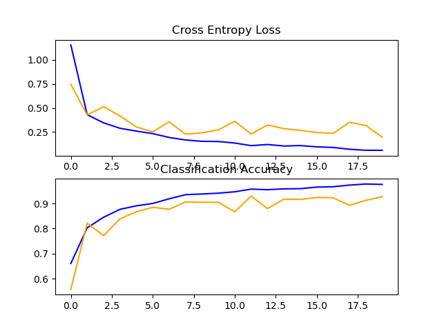
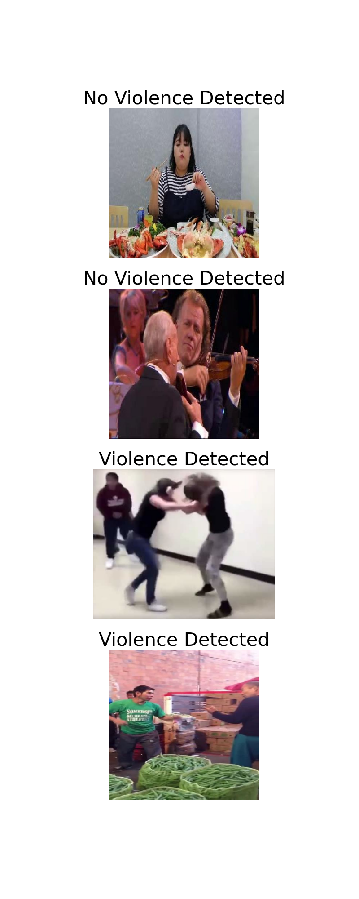

# Computer Vision Violence Classification

## Description
Computer Vision classification for violence using a VGG16 Architecture with pictures and videos.

## Features
- **VGG16 Architecture**: Three Convolution2D layers with a FC dense layer as the output
- **Libraries**: TensorFlow Keras and Sklearn for the model. CV2 and OS for data preprocessing.
- **Image Prediction**: Predicts violence for multiple images. Graphs their predictions with the original images using MatPlotLib.
- **Video Prediction**: Predicts violence for each frame of a video.
- **Video Blurring**: Capable of blurring violence detected frames of videos then writing the altered version to a new .mp4v

### Model's Accuracy & Loss


### Image Prediction Example


### Video Violence Blurring Example (click image)
[](https://www.youtube.com/watch?v=cKltZzBQpUw)

## Installation and Running the Script

To install and run the model on your Windows machine, follow these steps:

1. **Clone the Repository**: Download the codebase to your local machine.<br />
```https://github.com/EthanStanks/ViolenceClassificationCV.git```
2. **Install Dependencies**: Ensure you have Python installed, then use `pip` to install the required libraries.<br />
```pip install -r requirements.txt```
3. **Download Dataset**: Download the dataset from Kaggle then place the images inside:.<br />
```data/train_images/```
4. **Train Model**: Set TRAIN_MODEL boolean to True. Navigate to the ```src``` directory and execute the main.py script.<br />
```python main.py```
5. **Predict Images** Add images you'd like to predict inside `data/validate_images/`. Set PREDICT_IMAGES boolean to True. Add image paths to list on line 95. Execute the main.py script.<br />
```PREDICT_IMAGES = True```
6. **Predict Videos** Add the video you'd like to predict inside `data/video_input/`. Set PREDICT_VIDEO boolean to True. Add the file name to the function call on line 88. Execute the main.py script.<br />
```PREDICT_VIDEO = True```
6. **Blur Videos** Follow step 6. Ensure True is passed as second parameter on line 88. Execute the main.py script.<br />
```PREDICT_VIDEO = True```

## Credits

Data for this project is sourced from Kaggle's "Violence vs. Non-Violence: 11K Images Dataset" dataset, available [here](https://www.kaggle.com/datasets/abdulmananraja/real-life-violence-situations).

---

**Note**: This project is currently tailored for ```Windows operating``` systems.